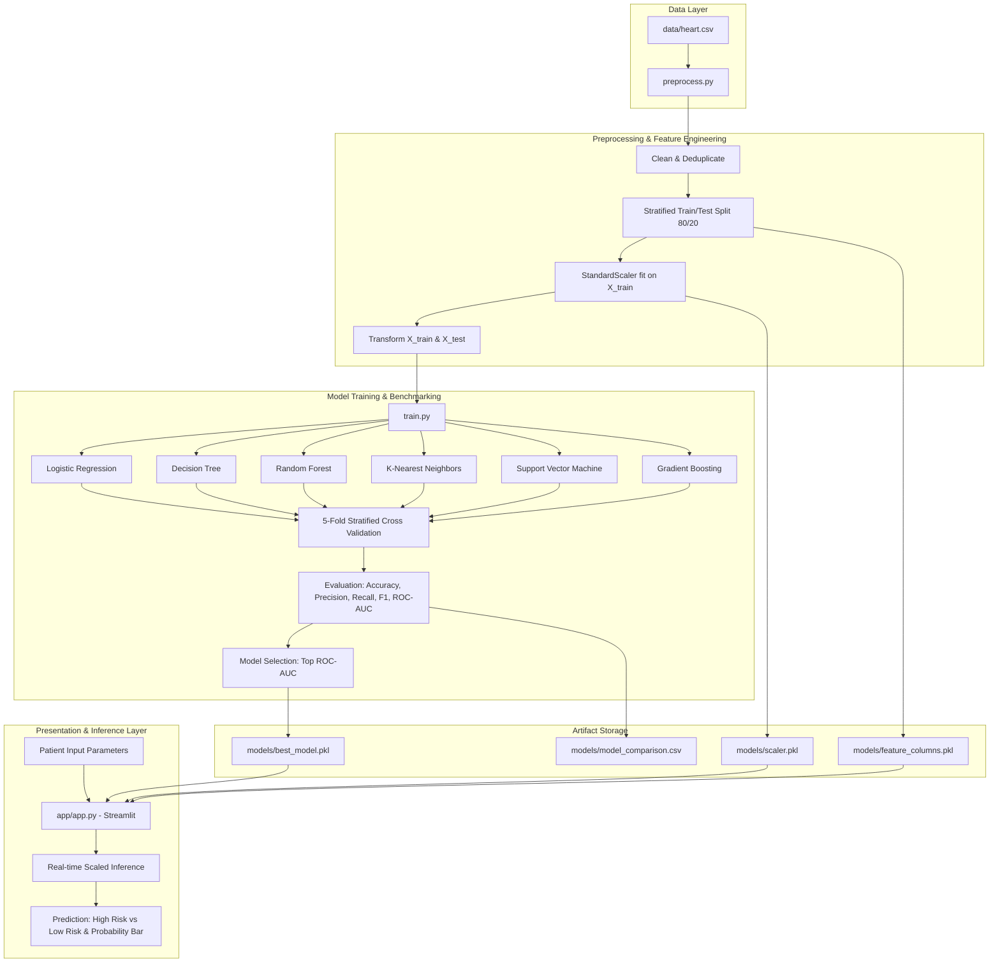
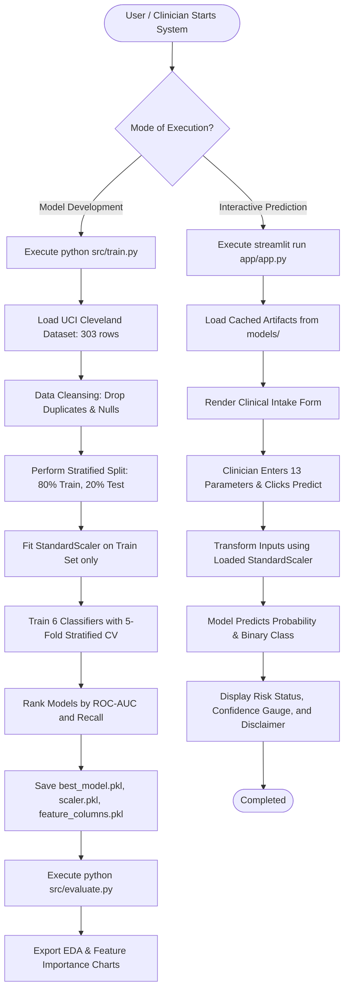

# Project Report: Heart Disease Prediction and Risk Assessment System

---

## 1. Executive Summary

Cardiovascular diseases (CVDs) represent the leading cause of mortality globally, claiming an estimated 17.9 million lives each year according to the World Health Organization (WHO). Early detection and accurate risk stratification are essential for timely clinical intervention and proactive lifestyle modifications. 

This project presents an end-to-end Machine Learning pipeline and an interactive clinical decision support application to predict the presence of heart disease using patient demographic, diagnostic, and physiological attributes. Using the benchmark **UCI Cleveland Heart Disease Dataset** (303 patient records, 13 clinical attributes), we systematically preprocess the data, prevent data leakage via rigorous stratified splitting and standard scaling, benchmark six distinct classification algorithms across 5-fold cross-validation, and deploy the optimal model via a user-friendly **Streamlit** web application.

---

## 2. Literature Survey

### 2.1 Clinical Background
Coronary artery disease occurs when major blood vessels that supply the heart become damaged or diseased, typically due to plaque buildup (atherosclerosis). Key physiological precursors include elevated resting blood pressure, hypercholesterolemia, exercise-induced ischemia, and abnormal ST-segment responses during stress testing.

### 2.2 Survey of Existing Studies
Numerous research efforts have applied data mining and machine learning techniques to clinical datasets:

1. **Detrano et al. (1989)**:
   * *Contribution*: Introduced the original Cleveland clinical database and evaluated logistic regression algorithms for diagnosis of coronary disease.
   * *Findings*: Achieved ~77% accuracy with catheterization-confirmed labels. Noted the high predictive power of chest pain type, exercise-induced angina, and fluoroscopy vessel counts.

2. **Mohan et al. (2019) — Hybrid Machine Learning Approach**:
   * *Contribution*: Evaluated hybrid techniques combining Linear Models with Random Forest on the UCI Cleveland dataset.
   * *Findings*: Reported that ensemble methods significantly outperform individual baseline classifiers by reducing variance across clinical samples, reaching ~88% accuracy.

3. **Almustafa (2020) — Comparative ML Classifiers**:
   * *Contribution*: Benchmarked K-Nearest Neighbors (KNN), Decision Trees, Support Vector Machines (SVM), and Naive Bayes on cardiovascular cohorts.
   * *Findings*: KNN and SVM with standardized inputs yielded the strongest decision boundaries on continuous physiological signals (like `thalach` and `chol`), provided feature scaling was strictly enforced.

4. **Kavitha et al. (2021) — Early Heart Disease Diagnosis**:
   * *Contribution*: Emphasized the clinical necessity of maximizing **Recall (Sensitivity)** over raw Accuracy, noting that false negatives in medical diagnostics represent unmanaged patient risk.

### 2.3 Research Gaps & Project Motivation
While previous studies achieved promising metric scores, many suffered from:
* **Data Leakage**: Fitting standard scalers or transformers across the whole dataset before train-test splitting.
* **Over-reliance on Accuracy**: Ignoring clinical trade-offs where recall and ROC-AUC are paramount.
* **Lack of Deployment**: Research confined to notebooks without deployable interfaces for clinician or patient self-assessment.

This project addresses these gaps with modular Python architecture, leak-free pipeline engineering, rigorous multi-metric benchmarking (Accuracy, Precision, Recall, F1, ROC-AUC, 5-Fold CV), and a production-grade Streamlit application.

---

## 3. Technology Stack

| Layer | Technology | Version / Tool | Purpose |
|---|---|---|---|
| **Language** | Python | 3.13 / 3.x | Core programming language |
| **Data Manipulation** | Pandas, NumPy | pandas 3.0+, numpy 2.5+ | Data cleaning, structuring, and array vectorization |
| **Machine Learning** | Scikit-Learn | scikit-learn 1.9+ | Feature preprocessing, cross-validation, metric tracking, model training |
| **Model Serialization** | Joblib | joblib 1.4+ | Efficient serialization of model weights, scalers, and schema |
| **Data Visualization** | Matplotlib, Seaborn | matplotlib 3.11+, seaborn 0.13+ | Exploratory Data Analysis (EDA) and feature importance visualization |
| **Application & UI** | Streamlit | streamlit 1.43+ | Interactive web interface for real-time risk assessment |
| **Version Control** | Git & GitHub | Git 2.x | Distributed version control and source code repository |

---

## 4. System Architecture & Flow Diagram

### 4.1 Modular System Architecture

### 4.2 End-to-End Execution Flowchart

---

## 5. Methodology

### 5.1 Dataset Schema
The project uses the 303-patient Cleveland dataset comprising 13 clinical predictors and 1 binary target:

| Feature | Type | Unit / Encoding | Clinical Relevance |
|---|---|---|---|
| **age** | Continuous | Years (29 – 77) | Primary demographic cardiovascular risk factor |
| **sex** | Categorical | 1 = Male, 0 = Female | Biological sex differences in cardiovascular prevalence |
| **cp** | Categorical | 0: Typical Angina, 1: Atypical Angina, 2: Non-anginal, 3: Asymptomatic | Nature of chest distress |
| **trestbps** | Continuous | mm Hg (94 – 200) | Resting systolic blood pressure on admission |
| **chol** | Continuous | mg/dl (126 – 564) | Serum cholesterol level |
| **fbs** | Binary | 1 = >120 mg/dl, 0 = <=120 mg/dl | Fasting blood sugar (diabetic indicator) |
| **restecg** | Categorical | 0: Normal, 1: ST-T wave abnormality, 2: Left ventricular hypertrophy | Baseline electrocardiographic status |
| **thalach** | Continuous | bpm (71 – 202) | Maximum heart rate achieved during stress test |
| **exang** | Binary | 1 = Yes, 0 = No | Exercise-induced angina |
| **oldpeak** | Continuous | ST depression value (0.0 – 6.2) | Exercise-induced ST depression relative to rest |
| **slope** | Categorical | 0: Upsloping, 1: Flat, 2: Downsloping | Slope of peak exercise ST segment |
| **ca** | Discrete | 0 – 3 | Number of major vessels colored by fluoroscopy |
| **thal** | Categorical | 1: Normal, 2: Fixed Defect, 3: Reversible Defect | Thallium heart scan response |
| **target** | Binary | 0 = No Disease, 1 = Disease Present | Diagnostic ground truth |

### 5.2 Preprocessing & Data Hygiene
1. **Deduplication**: Exact duplicate records are detected and filtered.
2. **Column Sanitization**: Headers are trimmed and normalized to lowercase to prevent index mismatch errors during inference.
3. **Data Leakage Prevention**:
   * Splitting occurs *before* any feature scaling.
   * `StandardScaler` calculates mean $\mu$ and standard deviation $\sigma$ strictly from $X_{\text{train}}$, preventing information from $X_{\text{test}}$ from biasing the normalization.

### 5.3 Model Formulations
Six diverse algorithmic approaches were chosen to benchmark linear, distance-based, tree-based, and ensemble techniques:
* **Logistic Regression**: Linear probability baseline with $L_2$ regularization.
* **Decision Tree (CART)**: Non-parametric tree splitting optimizing Gini impurity.
* **Random Forest**: Bagging ensemble of 200 uncorrelated decision trees mitigating variance.
* **K-Nearest Neighbors (KNN)**: Distance metric classifier ($k=7$) operating in standardized Euclidean space.
* **Support Vector Classifier (SVC)**: Kernelized classifier using Radial Basis Function (RBF) with Platt scaling for probability estimation.
* **Gradient Boosting Classifier**: Sequential boosting building trees to minimize deviance loss.

---

## 6. Experimental Results & Discussion

### 6.1 Comprehensive Model Comparison

All models were evaluated on an unseen test partition ($n=61$) after training on 5-fold cross-validation ($n=241$):

| Model | Accuracy | Precision | Recall (Sensitivity) | F1-Score | ROC-AUC | 5-Fold CV Mean | 5-Fold CV Std |
|---|---|---|---|---|---|---|---|
| **KNN ($k=7$)** | **0.8197** | 0.7895 | **0.9091** | **0.8451** | **0.8912** | **0.8219** | $\pm$ 0.0581 |
| **SVM (RBF Kernel)** | **0.8361** | 0.7949 | **0.9394** | **0.8611** | **0.8810** | 0.8219 | $\pm$ 0.0540 |
| **Random Forest** | 0.8033 | 0.7561 | **0.9394** | 0.8378 | 0.8820 | 0.8218 | $\pm$ 0.0439 |
| **Gradient Boosting** | 0.8197 | **0.8056** | 0.8788 | 0.8406 | 0.8690 | 0.7761 | $\pm$ 0.0345 |
| **Logistic Regression** | 0.7869 | 0.7632 | 0.8788 | 0.8169 | 0.8647 | **0.8259** | $\pm$ 0.0511 |
| **Decision Tree** | 0.7213 | 0.7105 | 0.8182 | 0.7606 | 0.7127 | 0.7513 | $\pm$ 0.0326 |

### 6.2 Confusion Matrix Analysis for Best Model (KNN)

On the test evaluation cohort (61 patients: 28 healthy, 33 heart disease):

| Actual \ Predicted | Predicted: No Disease (0) | Predicted: Disease (1) |
|---|---|---|
| **Actual: No Disease (0)** | **20 (True Negatives)** | 8 (False Positives) |
| **Actual: Disease (1)** | 3 (False Negatives) | **30 (True Positives)** |

* **Key Clinical Takeaway**: With only **3 False Negatives** out of 33 diseased cases, the model achieves a **90.9% Recall**, which is critical in medical diagnostics to prevent undiagnosed conditions from progressing.

### 6.3 Feature Importance Ranking (Random Forest)

Calculated via mean decrease in impurity (MDI):

| Rank | Feature | Relative Importance | Clinical Interpretation |
|---|---|---|---|
| 1 | `cp` | **13.65%** | Chest pain characteristics strongly distinguish angina etiology |
| 2 | `thalach` | **12.52%** | Maximum achieved heart rate indicates cardiovascular reserve |
| 3 | `ca` | **10.98%** | Number of vessels visible under fluoroscopy marks coronary blockage |
| 4 | `thal` | **10.84%** | Reversible perfusion defects indicate ischemia |
| 5 | `oldpeak` | **10.73%** | ST depression indicates degree of exercise-induced hypoxia |
| 6 | `age` | **9.12%** | Vascular aging and arterial stiffness increase with age |
| 7 | `chol` | **7.89%** | High serum cholesterol promotes atheroma plaque formation |
| 8 | `trestbps` | **7.70%** | Elevated resting BP contributes to long-term arterial stress |
| 9 | `exang` | **5.12%** | Angina during physical stress indicates coronary artery disease |
| 10 | `slope` | **4.79%** | Flat or downsloping ST indicates subendocardial ischemia |
| 11 | `sex` | **3.63%** | Gender-specific baseline risk disparities |
| 12 | `restecg` | **2.01%** | Baseline electrical irregularities |
| 13 | `fbs` | **1.02%** | Binary blood sugar status provides lower individual separation |

---

## 7. Interactive Clinical Application (Streamlit)

The web dashboard (`app/app.py`) provides an intuitive clinical interface:
1. **Dynamic Form Layout**: Organizes the 13 clinical inputs into a clean two-column grid.
2. **Clinical Value Mapping**: Form dropdowns display readable medical labels (e.g., "Atypical Angina", "LV Hypertrophy") while passing correct encoded integers to the backend.
3. **Instant Inference**: Normalizes the raw vector via the pre-fitted `StandardScaler` and queries the best-performing model.
4. **Visual Risk Indicators**: Displays color-coded risk alerts (Red alert for High Risk $\ge 50\%$, Green for Low Risk) accompanied by an animated probability gauge.
5. **Medical Ethics & Disclaimer**: Explicitly informs users that the tool serves educational/screening purposes and does not replace professional cardiologist evaluations.

---

## 8. Conclusion & Future Scope

### 8.1 Conclusion
This project designed and validated an effective machine learning decision support system for heart disease risk estimation:
* Systematic comparisons showed that **KNN** and **SVM** achieve superior discrimination (ROC-AUC $\approx 0.89$, Recall $\ge 91\%$).
* Feature importance analysis confirmed that chest pain characteristics (`cp`), maximum heart rate (`thalach`), fluoroscopy vessel counts (`ca`), and ST depression (`oldpeak`) represent the primary diagnostic signals.
* The modular pipeline architecture guarantees maintainability, reproducible preprocessing, and seamless interaction through Streamlit.

### 8.2 Future Scope
1. **Multi-Center Cohort Expansion**: Incorporating larger, diverse clinical cohorts (e.g., Framingham, UK Biobank) to improve demographic generalization.
2. **Explainable AI (XAI)**: Integrating SHAP (SHapley Additive exPlanations) or LIME to provide patient-specific waterfall plots justifying individual risk predictions.
3. **Electronic Health Record (EHR) Integration**: Developing FHIR/HL7-compliant REST APIs to allow automatic ingestion of patient vitals directly from hospital systems.
4. **Deep Learning & Tabular Transformers**: Evaluating TabNet or FT-Transformer architectures for self-supervised feature learning on large-scale clinical registries.

---

## 9. References

1. Detrano, R., Janosi, A., Steinbrunn, W., et al. (1989). *International application of a new probability algorithm for the diagnosis of coronary artery disease*. The American Journal of Cardiology, 64(5), 304-310.
2. World Health Organization (WHO). (2021). *Cardiovascular diseases (CVDs) Fact Sheet*. Geneva, Switzerland.
3. Mohan, S., Thirumalai, C., & Srivastava, G. (2019). *Effective heart disease prediction using hybrid machine learning techniques*. IEEE Access, 7, 81542-81554.
4. Almustafa, K. M. (2020). *Prediction of heart disease and classifiers' sensitivity analysis*. BMC Medical Informatics and Decision Making, 20(1), 1-18.
5. Pedregosa, F., et al. (2011). *Scikit-learn: Machine Learning in Python*. Journal of Machine Learning Research, 12, 2825-2830.
